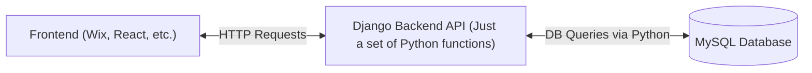

# Django Backend

## Explanation of Django

Okay so I think I made everything seem much more complicated
than I should've at our little meeting today.

This is all that needs to happen in our web app:



> *(Was this graph necessary?... no, but I did I have fun learning
about graphs in markdown files?... yup)*

So as far as Django goes, all we're doing is writing functions that
the frontend can call. You do this by writing functions that take an
HTTPRequest as input, and return a JSONResponse as output.

## How to make the API w/ Django

Here are the only files that we will use on a regular basis:

- api/urls.py
- api/views.py

There are obviously other files, but you'll touch them like once to configure something

### views.py

In views.py, you write the functions described above:

- It takes an HTTPRequest as input
- It returns a JsonResponse as output

```Python
from django.http import HttpRequest, JsonResponse

def blank_call(request: HttpRequest) -> JsonResponse:
    print(f"Somebody just sent an HTTP Request ({request.method})")

    return JsonResponse({ "message": "You called a function!" })
```

You can probably write all of the functions in views.py

> Note: You can write functions that take more inputs if you use generic
urls (Don't worry about those I had to look them up too and I still
don't really get them its fine)

### urls.py

In <u>**urls.py**</u>, this is where you define how the frontend calls
each function. There is literally only one variable that you have to edit:
the urlpatterns list. It's a list of urls bound to functions

> Note: This is currently the entire file pasted below lol

```Python
from django.urls import path
from . import views

urlpatterns = [
    path("", views.blank_call, name="blank_call"),
    path("print_hello_world", views.print_hello_world, name="print_hello_world")
]
```

You can probably look at this and understand:

- The first item in the current list binds {domain}/apicall/ to a function called
blank_call in the views module.
- The second item in this list binds {domain}/apicall/print_hello_world to
a function called print_hello_world in the view module

## Running the server

Navigate to the root of the project and type

```sh
./manage.py runserver
```

You can then go to localhost:8000/ in a browser

Note: You will need

- uv package manager
- Python 3.12+
