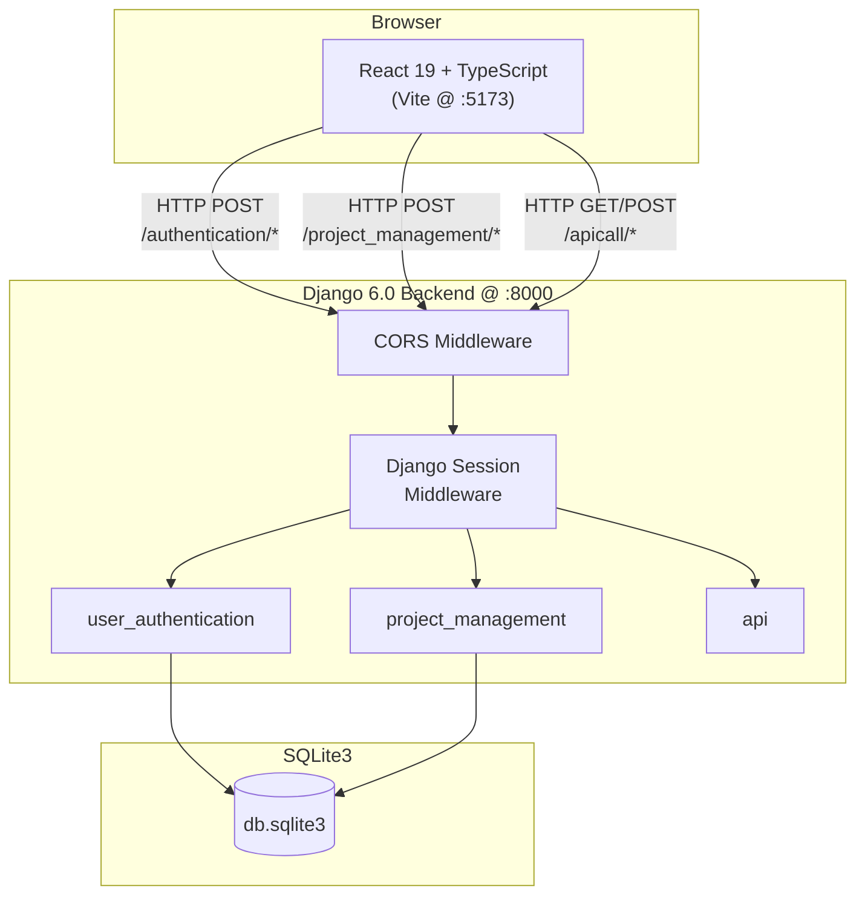
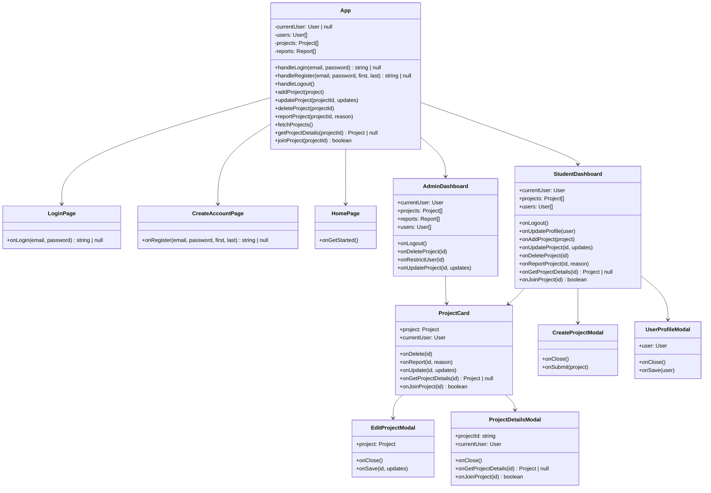
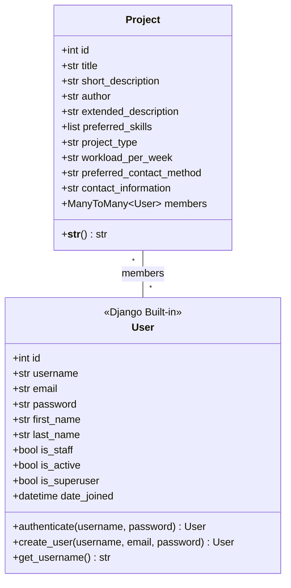
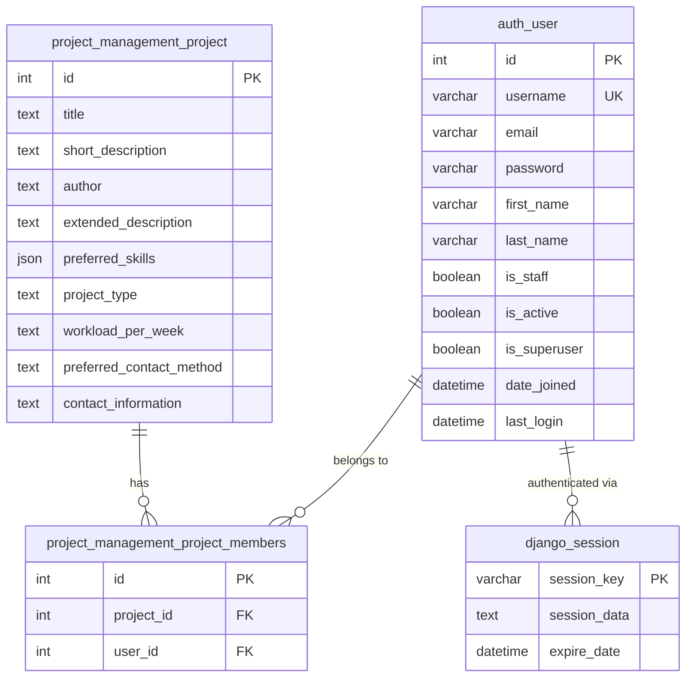
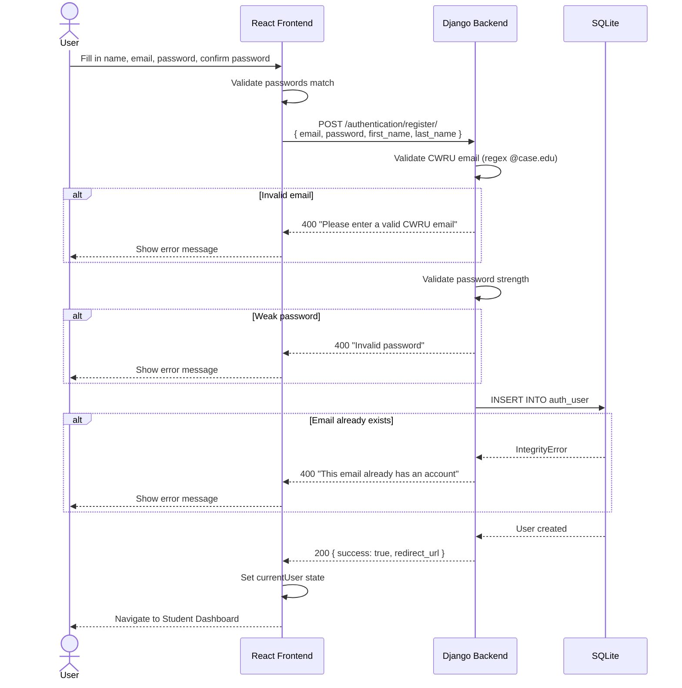
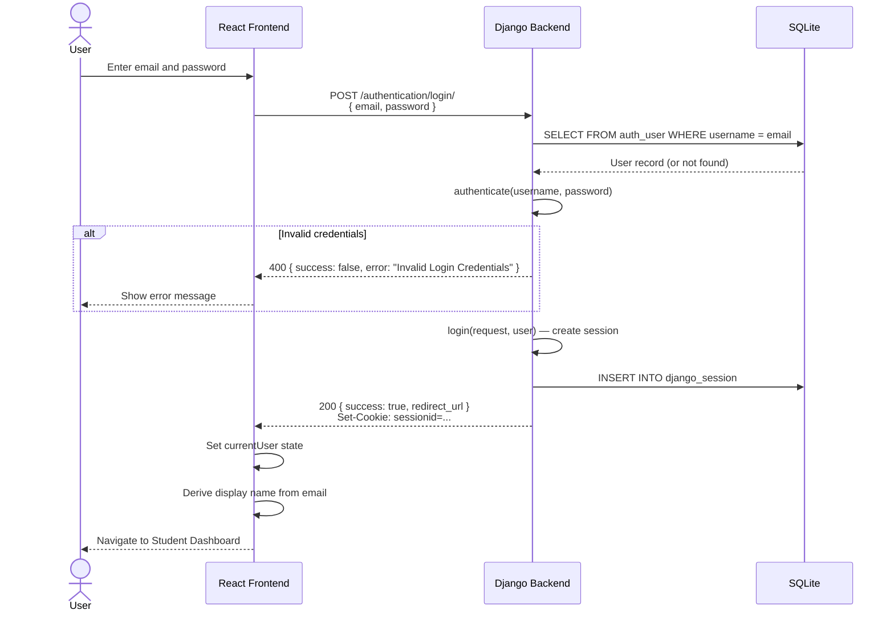
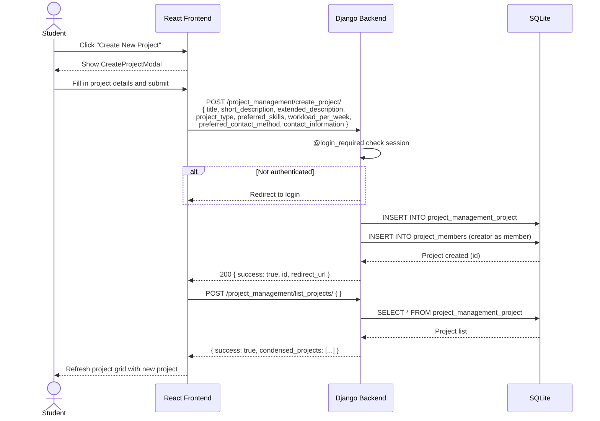
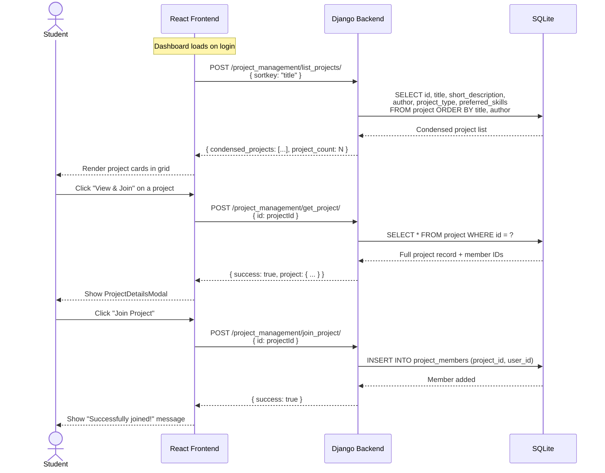
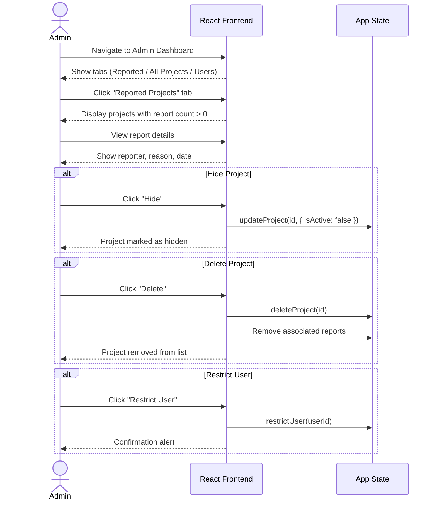

# Collabo — Architecture & Design Diagrams

## System Architecture

High-level overview of the Collabo platform. The React frontend (Vite dev server on port 5173) communicates with the Django backend (port 8000) via a Vite proxy. Django uses SQLite for persistence and Django's built-in session framework for authentication.



## Frontend Component Hierarchy

The React component tree showing parent-child relationships and which components render inside others. `App` is the root component and manages all application state. Routing determines whether the unauthenticated pages, the student dashboard, or the admin dashboard are displayed.

```mermaid
raph TD
    App["App<br/>(Router, State, API Calls)"]

    App -- "not logged in" --> Routes["Routes"]
    Routes --> HomePage
    Routes --> LoginPage
    Routes --> CreateAccountPage

    App -- "role = student" --> StudentDashboard
    App -- "role = admin" --> AdminDashboard

    StudentDashboard --> ProjectCard
    StudentDashboard --> CreateProjectModal
    StudentDashboard --> UserProfileModal

    ProjectCard --> EditProjectModal
    ProjectCard --> ProjectDetailsModal

    AdminDashboard --> ProjectCard_Admin["ProjectCard"]
```

## Frontend Component Diagram

Detailed view of each React component, its props, and the data it manages. This shows the contract between parent and child components across the application.



## Backend Class Diagram

Django models and their relationships. The application uses Django's built-in `User` model for authentication and a custom `Project` model for project data. Projects have a many-to-many relationship with users via the `members` field.



## Database / ER Diagram

Entity-relationship diagram showing all database tables, their columns, and the relationships between them. The `project_management_project_members` table is the auto-generated join table for the many-to-many relationship between projects and users.



## Sequence Diagram — User Registration

A new user registers with their CWRU email address. The frontend validates the password match locally, then the backend validates the email domain, checks password strength, and creates the user record.



## Sequence Diagram — User Login

An existing user logs in. Django's built-in `authenticate()` and `login()` functions handle credential verification and session creation.



## Sequence Diagram — Create Project

An authenticated student creates a new project. The `@login_required` decorator ensures the user has a valid session before processing.



## Sequence Diagram — Browse & Join Project

A student browses the project list, views details of a specific project, and joins it. This involves three sequential API calls.



## Sequence Diagram — Admin Moderation

An admin reviews reported projects and takes action (hide, delete, or restrict user). These operations currently happen client-side only.


